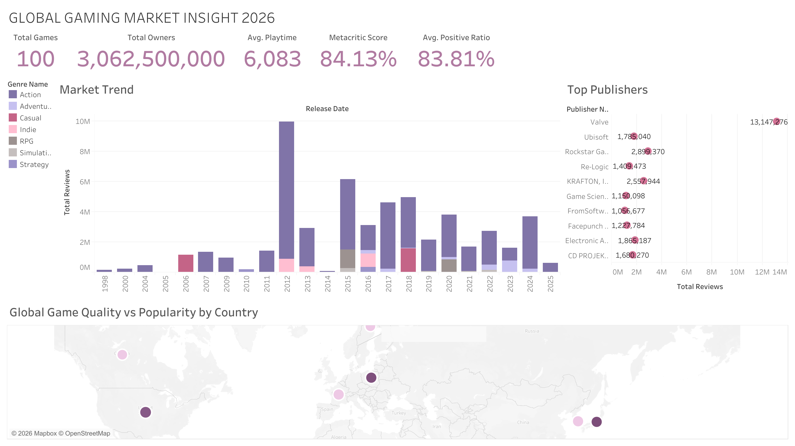

# 🎮 Gaming Market Insight Dashboard (Tableau)

🔗 **Live Dashboard:**
👉 [https://public.tableau.com/shared/5SQ5GSMB9?:display_count=n&:origin=viz_share_link]

---

## 📊 Project Overview

This project presents an interactive Tableau dashboard analyzing global gaming market trends, publisher performance, and player engagement.

The goal is to simulate how a data analyst would deliver actionable insights to business stakeholders in the gaming industry.

---

## 🚀 Key Insights

* 🎯 Total of **100 games analyzed** with over **3B+ total ownership**
* 🏆 **Valve** dominates publisher engagement with the highest review volume
* 📈 Strong growth in gaming activity after 2015
* ⭐ High correlation between **Metacritic score** and **user positive ratio**

---

## 🧠 Business Value

This dashboard helps answer:

* Which publishers dominate the market?
* What drives player engagement?
* How does game quality impact popularity?
* What are long-term market trends?

---

## 🛠️ Tools Used

* Tableau (Dashboard & Visualization)
* SQL (Data preparation)
* Excel / CSV (Data source)

---

## 📸 Dashboard Preview

---

## 📌 How to Use

1. Click the live dashboard link above
2. Explore filters (genre, year, publisher)
3. Interact with charts for deeper insights

---

## 👩‍💻 Author

Gia Hu
Data Analyst | SQL | Python | Tableau

---

## ⭐ Why This Project Matters

This project demonstrates:

* Data storytelling
* Business-oriented analysis
* Interactive dashboard design
* End-to-end analytics workflow
